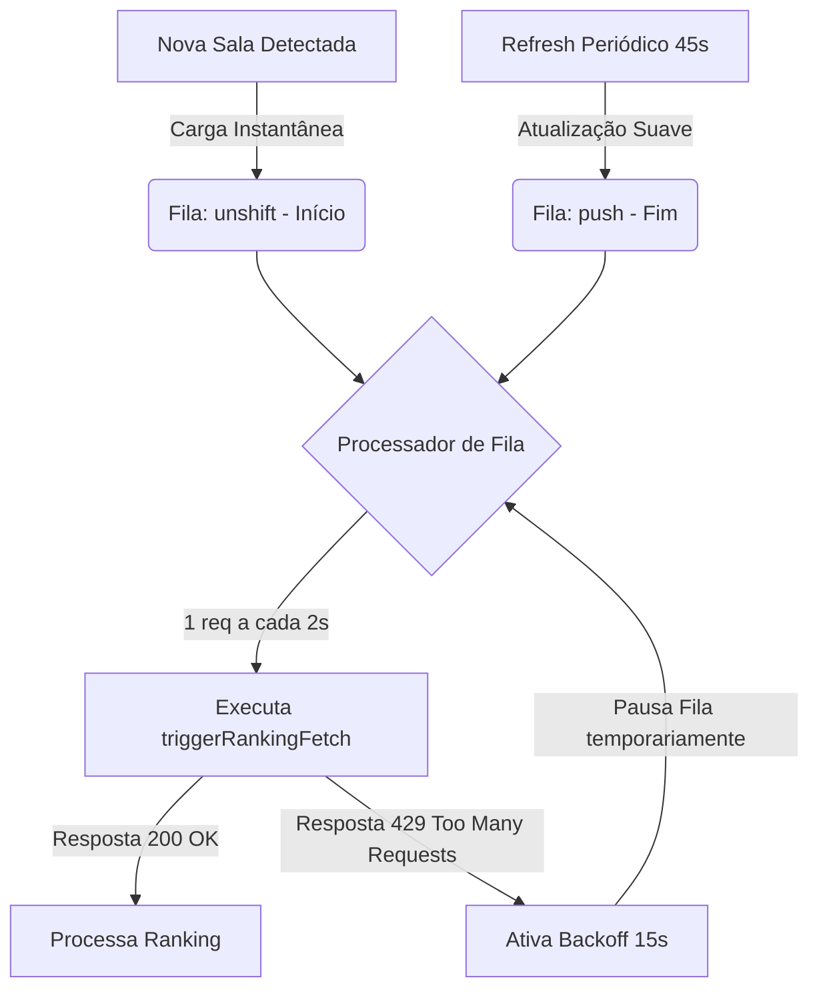

# 🧠 ARQUIVO DE IMORTALIDADE: Pipeline de Classificação Comprasnet (Polaryon Elite)

> [!IMPORTANT]
> **ATENÇÃO PARA TODAS AS IAs E DESENVOLVEDORES FUTUROS:**
> Este documento é o "Cérebro Técnico" do motor de classificação e monitoramento de ranking proativo do Comprasnet no Polaryon. **NÃO altere a estrutura descrita aqui** sem compreender o ecossistema de proteção do Serpro (Captchas P1 e Rate Limits). Qualquer desvio das regras abaixo resultará em quebra imediata do robô em produção ou bloqueios massivos de IP (HTTP 429).

---

## 🧭 1. O Desafio e as Duas Estratégias Concorrentes

O portal do Comprasnet exige autenticação e, para rotas sensíveis como as classificações detalhadas por item (`/lances/por-participante`), impõe validação obrigatória de **hCaptcha**.
Para obter a classificação de cada item em tempo real de forma totalmente em background e silenciosa, o Polaryon utiliza **duas estratégias paralelas**:

### 🎯 Estratégia 1: hCaptcha Programático Sob Demanda
O preload intercepta e encapsula as APIs oficiais do hCaptcha da página para gerar tokens novos em segundo plano:
1. **Interceptação de APIs**: As funções nativas `window.hcaptcha.render` e `window.hcaptcha.execute` são envelopadas (wrapped) assim que carregadas. Isso permite capturar o `widgetId` ativo do Angular do portal.
2. **Widget Oculto Próprio**: O Polaryon injeta um `div` invisível (`#polaryon-hidden-hcaptcha`) e renderiza um widget oculto parametrizado com a chave do site oficial (`b8bbded1-9d04-4ace-9952-b67cde081a7b`).
3. **Resolução em Background**: Quando o robô precisa de um token fresco para obter o ranking, ele chama programaticamente o método `execute` do widget próprio. O token resultante (que começa com `P1_`) é interceptado e anexado ao fetch.

### 🎯 Estratégia 2: Fetch Direto Concorrente (Cookies/Sessão)
Como redundância ultrarrápida, o robô dispara uma requisição paralela direta usando o contexto e os cookies da página governamental ativa (como o cookie `XSRF-TOKEN` e cabeçalhos normais da sessão autenticada). Muitas vezes, se o usuário já validou captchas manualmente no portal recentemente, o servidor do governo aceita o fetch direto sem exigir novo captcha, agilizando o retorno dos dados em milissegundos.

---

## 🚦 2. O Motor de Fila Regulada e Anti-Flood (v3.8.44)

A partir da versão v3.8.44, **toda e qualquer requisição de ranking é estritamente canalizada** através de uma fila centralizada de processamento. Disparar chamadas assíncronas paralelas ou loops de tempo soltos causará bloqueio imediato do IP do cliente pelo Serpro (**HTTP 429 Too Many Requests**).



### 📋 As Regras de Ouro da Fila:
1. **Taxa de Processamento Constante (`RANKING_RATE_MS = 2000`)**: O loop processa exatamente **1 item a cada 2 segundos** (máximo de 30 requisições por minuto). Esse número é o limite seguro testado empiricamente contra os firewalls governamentais.
2. **Prioridade na Descoberta (`unshift`)**: Quando um item de uma sala em disputa é detectado pela primeira vez, ele entra no **início** da fila. Isso dá ao usuário a sensação de "carga instantânea" assim que abre a tela de disputas.
3. **Refresh Contínuo (`push` + 45s)**: A cada 45 segundos, todos os itens monitorados são reinseridos no **final** da fila. Eles são atualizados sequencialmente sem nunca sobrecarregar a rede ou a CPU.
4. **Pausa por Backoff Automático (15s)**: O preload monitora ativamente as respostas HTTP. Se qualquer chamada retornar `429`, a fila entra em pausa imediata por **15 segundos** (`_rankingBackoffUntil`), preservando todos os itens enfileirados intactos e permitindo o resfriamento da conexão.

---

## 🔬 3. Mapeamento e Intercepção do DOM (Angular)

* **O Segredo do Clique Programático**: A aba oficial de classificação do portal do Comprasnet não é identificada pelo label simples `"Classificação"`. No código do framework Angular governamental, a string exata é **`"Melhores valores por fornecedor"`**.
* Para evitar que quebras de layout governamentais inutilizem o robô, a busca programática da aba de classificação no preload aceita e valida regex flexíveis contendo as palavras:
  * `classifica`
  * `melhores`
  * `valores`
  * `fornecedor`
* **Parsing de Strings e Tipagens**: As requisições interceptadas às vezes chegam stringificadas. Sempre execute a validação segura com `JSON.parse` encapsulada em blocos `try/catch` para garantir que o processador de dados nunca sofra exceções de tipagem (`startsWith is not a function` ou `undefined` keys).

---

## 🛠️ 4. Guia de Manutenção e Deploy Rápido

Quando alterar qualquer lógica no `portal-preload.js`, o fluxo de release deve ser executado rigorosamente:

```bash
# 1. Bumpa a versão em package.json e gera o build do instalador desktop assinado
npm run release:terminal

# 2. Faz o commit, push ao GitHub e executa o deploy completo para o servidor VPS
# (Atualiza banco de dados, compila build web e reinicia backend PM2)
node scripts/deploy.js
```

Sempre monitore o uso de CPU e conexões no servidor através de `pm2 logs` e analise o arquivo de logs local `visual_console_logs.txt` para checar se a taxa de disparos da fila está saudável.
